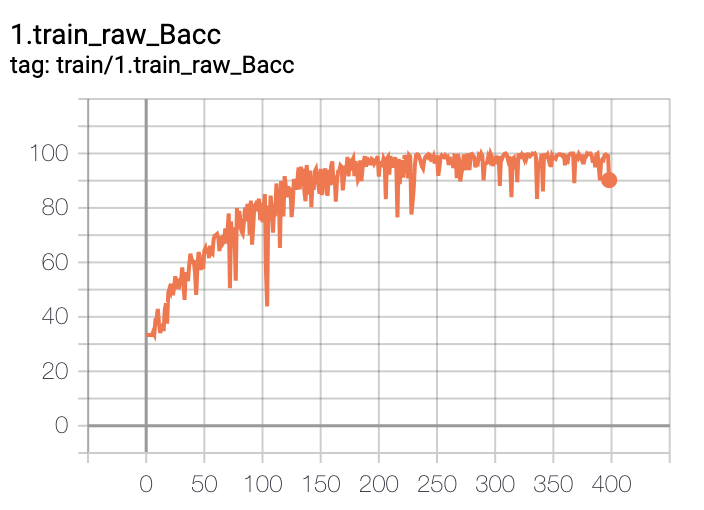
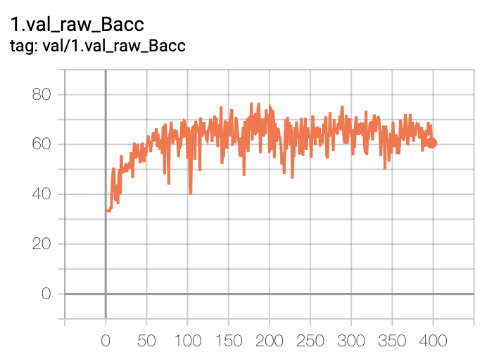
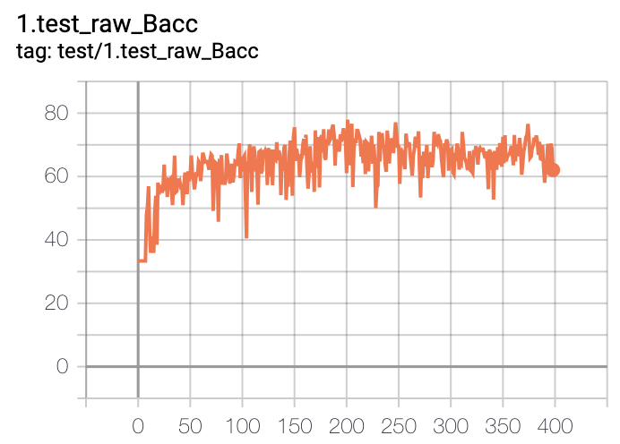

# Our Changes
### Objective
We forked the SAMIL repository in an attempt to reproduce the changes from the paper Detecting Heart Disease from Multi-View Ultrasound Images via Supervised Attention Multiple Instance Learning (MLHC'23) for CS 598 Deep Learning for Healthcare. 

### Video Presentation
You must be signed in to @illinois.edu email to access the video presentation. 

Video Presentation: https://drive.google.com/file/d/1lycdkACwjLFaOlaAyUtQtwoldYHbg9gS/view?usp=sharing

# Setup
We needed to perform additional structuring on the data set in the released TMED2. We added a script to organize the data and added changes to Echo_data.py to process the bags of images. We put the labeled and unlabeled images for the same study under same folder.

### Prepare datasets
The AS diagnosis task in this study uses the view_and_diagnosis_labeled_set from TMED2 
- Step1. Download TMED2, please visit https://TMED.cs.tufts.edu and follow the instruction.
- Step2. Run ```bash organize_tmed2.sh <labeled_dir> <unlabeled_dir> <output_dir>``` on downloaded view_and_diagnosis_labeled_set folder

### Environment
The original authors used pytorch 1.11.0 but we found it difficult to download this dependency.

We used Google Colab Pro to run our experiments on T4 GPU. 

We installed the following dependencies along with Python 3.11.11.

```pip install torch==2.0.1+cu118 torchvision==0.15.2+cu118 torchaudio==2.0.2 -f https://download.pytorch.org/whl/torch_stable.html ``` 


# Running experiments locally
Run ```bash setup.sh ``` to set the environmental variables and run the SAMIL experiment locally.

# Running experiments on Google Colab Pro
Use [original_samil.ipynb](final_results/original_samil_results/original_samil.ipynb) to run the experiment on SAMIL model in the research paper.

# Results
We ran two full model runs. The [original_samil.ipynb](final_results/original_samil_results/original_samil.ipynb) runs the SAMIL model defined in the paper. The [modified_samil.ipynb](final_results/modified_samil_results/modified_samil.ipynb) runs SAMIL with added drop out layers. 

We also added the balanced accuracy results and loss per epoch for each model run as well as the model checkpoint at the best balanced accurracy in [here](final_results/). 

# Pretrained view classifiers and checkpoints

The original authors released the pretrained view classifiers and MOCO pretrained checkpoints and the traning curves of SAMIL (retrained, for reference) [here](https://tufts.box.com/s/c5w8123j7h3dpls75jye1363uh8qv8us). 
You can montior the training using tensorborad, and are expected to see training curves like this:

<p float="left">
  
  
  
</p>

### Hyperparameters
Please see [Hyperparameters/](Hyperparameters) for reference. You can also tried searching hyperparameter yourself.

### Example
Running SAMIL with study-level pretraining, go to [runs/SAMIL](runs/SAMIL)
```bash launch_experiment.sh run_here``` or use the custom ```setup.sh``` script provided

### A note on reproducibility
While the focus of our paper is reproducibility, ultimately exact comparison to the results in our paper will be conflated by subtle differences such as the version of Pytorch etc (see https://pytorch.org/docs/stable/notes/randomness.html for more detail).

From our experiment, we notice that there might be a few percentage variation from run to run. This is especially the case for Split1. Split0 and Split2 has less varation. (Possibly due to training signals in MIL are noisy. Another possiblity is that small validation set size might caused the selection of checkpoint at maximum validation performance not always correspond to good test performance.)

## Citing this work
@article{huang2023detecting,
  title={Detecting Heart Disease from Multi-View Ultrasound Images via Supervised Attention Multiple Instance Learning},
  author={Huang, Zhe and Wessler, Benjamin S and Hughes, Michael C},
  journal={arXiv preprint arXiv:2306.00003},
  year={2023}
}
